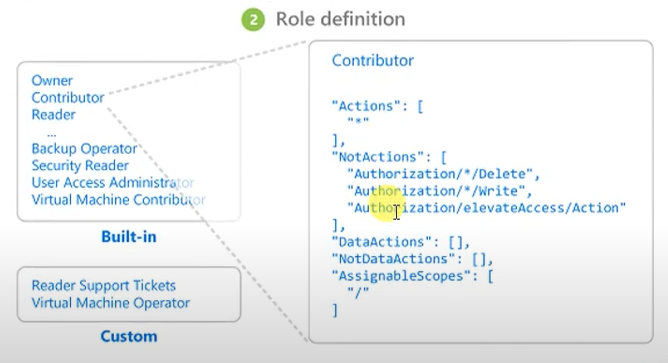
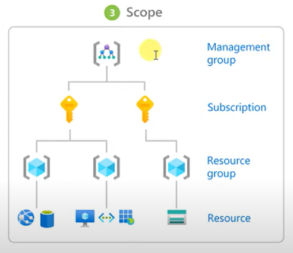

# Azure Identity Server

Initially we were using work domain and after that we come across domain.
## Identity Server
An Identity Server is a tool that manages who can access various applications and services within an organization. Think of it like a security guard at the entrance of a building.

Identity Server is an open-source authentication and authorization platform that implements the OpenID Connect and OAuth 2.0 standards. It provides developers with a way to add centralized login functionality to applications, ensuring that users can authenticate securely and access resources according to their permissions.
## Real-Time Example of Why We Need Identity Server

### Scenario: Global Financial Services Firm

A global financial services firm operates in multiple countries, offering banking, investment, and insurance services. With thousands of employees, clients, and partners accessing its systems daily, the firm faces several challenges.

### Challenges

1. **Complex IT Environment**: The firm uses various applications, both on-premises and in the cloud, each requiring secure access control.
   
2. **Security Risks**: Sensitive financial data needs protection, ensuring only authorized users have access.

3. **Regulatory Compliance**: The firm must meet financial regulations like GDPR and PCI-DSS, requiring strict access controls and audit trails.

4. **User Experience**: Employees and clients need seamless access to multiple systems without frequent logins.

### Solution: Implementing an Identity Server

1. **Centralized Authentication**: Identity Server centralizes user authentication, simplifying credential management and enhancing security.

2. **Single Sign-On (SSO)**: Users log in once to access all applications, improving productivity and satisfaction.

3. **Multi-Factor Authentication (MFA)**: Adds security by requiring additional verification steps.

4. **Role-Based Access Control (RBAC)**: Ensures users access only resources relevant to their roles.

5. **Integration with Cloud Services**: Consistent access management across on-premises and cloud environments.

6. **Compliance and Auditing**: Provides detailed logs to meet regulatory compliance and conduct audits.

### Benefits

- **Improved Security**: Reduces unauthorized access risks, protecting sensitive data.(The Identity Server ensures that only authorized people can access certain applications and data, much like a guard checking if you have the right credentials to enter a secure area.)
- **Enhanced User Experience**: Simplifies the login process, allowing users to focus on tasks. (With an Identity Server, you only need to log in once to access all the services and applications you're allowed to use. It's like having a single key that opens multiple doors.)
- **Regulatory Compliance**: Ensures compliance with financial regulations.(The Identity Server keeps track of who accesses what, helping organizations follow rules and regulations. It's like maintaining a log of who visits which areas in a building for security purposes.)
- **Streamlined IT Management**: Simplifies managing multiple applications and systems.(It helps organizations easily add new users, adjust their access rights, or remove access when necessary. This is similar to updating a list of who can enter a building or specific rooms.)

## What is Active Directory?
Active directory is an identity provider. Microsoft introduced it with Windows Server 2000. It is a centralized repository of users, groups, devices, and organizational units. 

It manages group policies to control different objects and provides a centralized authentication system.

**Use Case**: An organization can use group policy to display a single wallpaper across all 500 employees' devices.

Active directory is used to manage permissions and access to networked resources. We can integrate AD with Identity Server to leverage its existing user and group management capabilities for authentication purposes.

**Integration**: Identity Server can use AD as a user store, allowing organizations to authenticate users against their existing AD infrastructure.
**Federation**: By integrating with AD, Identity Server can provide federated identity services, enabling users to access resources in different domains without needing separate credentials.

## What is azure AD?
Azure Active Directory (Azure AD) is a cloud-based identity and access management service provided by Microsoft. It helps organizations manage user identities and access to resources both on-premises and in the cloud. 

Azure AD offers features like single sign-on, multi-factor authentication, and conditional access to ensure secure and efficient management of users and resources.

In azure AD azure will copy of your directory data in to at least 2 reason for high availability. So even a data centre will go down it is highly reliable.

**Use Case**: A multinational corporation with employees working remotely can use Azure AD to provide secure access to corporate applications. Employees can log in once using single sign-on (SSO) and access all necessary applications without having to enter credentials multiple times. This improves productivity and security by ensuring that only authorized users can access sensitive resources.

## Why Do We Need Azure AD?

Organizations need Azure AD to streamline identity management and enhance security for users and resources. With the increasing shift to cloud-based solutions and remote work, managing access efficiently and securely is crucial. Azure AD provides tools to manage user identities, control access, and ensure compliance with security policies.

**Use Case**: A university with students, faculty, and staff using various online platforms for learning and administration can implement Azure AD to manage access. Azure AD enables the university to enforce policies like multi-factor authentication, ensuring that only authorized users access sensitive information like grades or payroll data. It also simplifies the login process for users, allowing them to access multiple applications with a single set of credentials.

## Azure active directory Roles, RBAC, Custom Roles

## Azure AD Roles
The roles that can manage only azure AD resource, like if you remember in on premises in Active directory we have a role that called Domain Admin that role manage the domain controller in Active directory, that basically create the user manage the password and manage the group policies, Similarly azure AD roles manage azure AD.

Azure AD roles have there own responsibilities, it never impact any other roles responsibilities.
1) **Global Administrator**: 
Manage access to all administrative feature as well as service that are dependent to azure AD.
Assign administrator roles to others.
Reset the password for any used and all other administrator.

2) **User administrator**:
Create and manage all user and groups.
Manage support tickets
Monitor health Service
Change passwords for user, helpdesk administrator and other user administrators

2) **Billing administrator**:
Create subscriptions
Manage subscriptions
Manage support tickets
Monitor health Service

## Azure AD RBAC
Azure role-based access control (Azure RBAC) helps us to manage the access of Azure resources, means what all access is required for a resource read or write, and at what level  access is required role based or group based or subscription level.

A role assignment consists of three elements: security principle, role definition and scope.

1) Security principle
A security principle is an object that represents a **user, group, service principle or managed identity** that is requesting access to azure resources. We can assign a role to any of these security principles.

2) Role definition
A role definition is a collection of permission and it is JSON based document, it is typically just called a role. A role definition lists the operations that can be performed such as read write and delete, Roles can be high level like owner or specific like virtual machine reader.

So let us say if we have created a role so which type of definition (owner, reader, contributor) we are going to provide that comes under role definition.

3) Scope
Scope is the set of resources where the access applies to, when we create a role we can further limit the actions allowed by a definition scope.

This is helpful if you want to make someone a website Contributor, but only for one resource group.

In Azure we can specify a scope at four levels.
1) Management group
2) Subscription
3) Resource group
4) Resource
Scopes are structured in a parent-child relationship

# Lab - 1
## Create an user and provide a role on different level
1) **Step 1**: Create an user(tom) from azure active directory
2) **Step 2**: Create a resource group
3) **Step 3**: Go on resource group -> Access control(IAM)->Add> Add role Assignment->Role(Contributor)->Assign Access to(User, group, or service principle)->Select(created username tom)
4) **Step 4**:We can create another resource group and it will be not accessible to (tom)

We can also create a custom role.

## Custom Roles
If the Azure built-in roles don't meet the specific needs of our organization we can create our own custom roles, just like built in roles and we can assign custom roles to users, groups and service principles at management group, subscription and resource group scopes.
Custom roles can be shared between subscription that trust the same azure AD directory, there is a limit of 5000 custom roles per directory.

- **Prerequisites**
To create custom roles we need :
- Permission to create custom role, such as Owner or User Access Administrator

**use case** - customized laptop, customised clothe

# Lab - 2
## Create a custom Role
1) **Step 1**: Go to Subscription-> Roles (here all built-in roles are available)->Add->Add Custom Role
2) **Step 2**: Add Custom Role->Basics->Custom Role Name->Start from Scratch->Next
3) **Step 3**: Add permission->Compute(Microsoft Compute)->go to virtual machine section(Start Virtual Permission)
4) **Step 4**: Add permission->Compute(Microsoft Storage)->go to Storage section(Delete Storage Account)
5) **Step 5**: Add scope (Management Group, Subscription level, resource group or resource)

## Create a custom Role using PowerShell
We have to write the below commands to create the new custom role

first we need to open local PowerShell in admin mode

**Step 1**: connect-AzAccount -> need to put credentials

**Step 2**: New-AzRoleDefinition -InputFile "custom-role.JSON"

Below command will assign the permissions to the user on newly created custom role on the resource group

**Step 3**: New-AzRoleAssignment -ResourceGroupName "RGNAME" -SignInName USER ID -RoleDefinitionName "ROLE NAME"

Now we can go in resource group -> IAM and we can see the assigned roles here.

# On Premise AD vs Azure AD
On Premise AD uses NTDS(Jet database), it can add machine to domain, it can apply group policy.
On Premise AD require physical or VM to deploy, and replication is possible between DC's

Azure AD uses SQL database , there is no support to join machine except windows 10 for SSO also there is provision for group policy.
Azure AD  does not require physical or VM to deploy it comes PAAS, and replication is is managed by Azure across 3 region.

# Azure AD Connect
Synchronizing on premise AD users to Azure AD we use AD Connect, we can download this tool and install in any of the member server or any domain controller in our On-Premise Environment

Using the AD connect we can take advantage like:

- User can use a single identity to access on-premises application and cloud services such as Microsoft 365.
- Single tool provide an easy deployment experience for synchronizing and sign in.
- Provides the newest capabilities for your scenario. Azure AD connect replaces older version identity integration tools like DirSync and Azure AD Sync.

## Azure AD Connect Features
Azure AD Connect is a tool that connects on-premises directories with Azure Active Directory, providing a seamless identity experience across environments. Below are the key features of Azure AD Connect:

## 1. Password Hash Synchronization

**Description:**  
Password Hash Synchronization (PHS) synchronizes a hash of the on-premises Active Directory (AD) password to Azure AD. This allows users to use the same password for accessing both on-premises and cloud services like Microsoft Office 365.

**Simple Use Case:**  
Your employees can log in to cloud services like Office 365 using the same password they use for their office computers, making it easier for them to remember their credentials.

## 2. Pass-Through Authentication

**Description:**  
Pass-Through Authentication (PTA) allows users to sign in to both on-premises and cloud applications using the same password, without storing the password or hash in Azure AD. Authentication requests are validated directly against the on-premises AD.

**Simple Use Case:**  
Employees can use their usual office password to access cloud applications, and the verification happens directly on the office network, adding an extra layer of security without additional infrastructure.

## 3. Federated Integration

**Description:**  
Federated integration enables Azure AD to trust an external identity provider for authentication. This typically involves setting up a federation server on-premises, such as Active Directory Federation Services (AD FS).

**Simple Use Case:**  
If your company has complex login requirements, like using smart cards or advanced security methods, federated integration allows all those systems to work together seamlessly.

## 4. Synchronization

**Description:**  
Synchronization ensures that user accounts, groups, and other directory objects are kept in sync between on-premises AD and Azure AD. This includes attributes like usernames, email addresses, and passwords.

**Simple Use Case:**  
When you hire a new employee and add them to the office system, they automatically get access to cloud resources without setting up new accounts, saving time and reducing errors.

## 5. Health Monitoring

**Description:**  
Azure AD Connect Health provides monitoring, alerting, and insights for your on-premises identity infrastructure. It helps identify issues with synchronization, authentication, and overall system health.

**Simple Use Case:**  
IT staff receive alerts if there’s a problem with user logins, allowing them to fix issues before users even notice something is wrong.

## 6. Filtering

**Description:**  
Filtering allows organizations to select which objects (users, groups, etc.) are synchronized from on-premises AD to Azure AD. This can be based on attributes, organizational units, or domains.

**Simple Use Case:**  
You can choose to sync only certain departments or groups to the cloud, ensuring that only relevant users are given cloud access.

## 7. Password Writeback

**Description:**  
Password Writeback allows users to change or reset their passwords in Azure AD, with changes being written back to the on-premises AD. This feature supports self-service password reset capabilities.

**Simple Use Case:**  
Employees can reset their own passwords through a cloud portal, and it automatically updates their office computer login, reducing calls to IT support.

## 8. Device Writeback

**Description:**  
Device Writeback enables Azure AD-joined devices to be registered in on-premises AD. This allows on-premises resources to recognize Azure AD-joined devices and apply conditional access policies.

**Simple Use Case:**  
When employees use their personal devices to access work systems, those devices are recognized and can be managed like office devices, maintaining security.

## 9. Automatic Upgrade

**Description:**  
Automatic Upgrade keeps Azure AD Connect up to date by automatically applying new updates and features. This ensures that the tool remains secure and performs optimally without manual intervention.

**Simple Use Case:**  
Your IT team doesn’t have to worry about manually updating the system, as it automatically stays current with the latest security and feature updates.

## Azure AD Password hash technique.
## Lab 3
**Step 1**

## Azure AD Password Writeback technique.
## Lab 3
**Step 1**

## Multifactor Authentication
Multifactor Authentication is a process where a user is prompted during the sign-in process for an additional form of identification, such as to enter a code on their cell phone or to provide a fingerprint scan.
If we only use a password to authenticate an user , it leave an insecure vector for attack.

Azure multi-factor authentication works by requiring two or more of the following authentication method. 
1) password
2) any trusted device that is not easily duplicated like a phone or a hardware key.
3) biomatrices like a fingerprint or face scan.

**Use Case**: Like security in our office, when we enter in our office there is main gate security, after one level of scan we use another level of scan to enter in project development area.

## Lab 4a
**Step 1** Azure Active Directory-> Users-> Create An User -> Select Multifactor Authentication
**Step 2** Select User -> Enable
**Step 3** now open incognito and login with new user

## Lab 4b Advance Settings
**Step 1** Azure Active Directory-> Users-> Create An User -> Select Multifactor Authentication
**Step 2** Select User -> Enable
**Step 3** now open incognito and login with new user

## Custom Domain
We can add custom domain name in 
## Lab 
**Step 1** Add new custom domain-> create txt type record and map with domain provider in DNS section

## Azure AD join
We can join and register devices with azure AD join, this is good when employee bring their own devices.
We can configure azure AD registered device with WINDOWS 10, IOS, Android and MacOS (Except Windows Server).

**Enterprise state roaming** - This feature is only available with premium tier, using this feature user can securely synchronize their user settings and application setting data to the cloud.
## Lab 
**Step 1** Add 

## Azure AD dynamic groups

## Azure Active Directory Self-Service Password Reset (SSPR)

Azure Active Directory Self-Service Password Reset (SSPR) is a feature that allows users to reset their passwords without needing to contact the IT helpdesk. This feature enhances security and user experience by providing a simple, secure method for users to manage their own passwords.

### Key Features

- **User Empowerment**: Users can reset their passwords and unlock their accounts anytime, anywhere.
- **Secure Authentication**: SSPR uses multi-factor authentication (MFA) to verify user identity before allowing a password reset.
- **Customizable Policies**: Organizations can configure the reset process to meet their security and compliance requirements.

### Simple Use Case

**Scenario:**  
A medium-sized company has many remote employees who occasionally forget their passwords. These employees often need to contact IT support, which can delay their ability to work, especially outside of regular business hours.

**Solution:**  
With Azure AD SSPR, remote employees can reset their passwords themselves through a secure web portal. The system asks for additional verification, such as a code sent to their phone or an email link. Once verified, they can set a new password.

**Benefits:**

- **Reduced IT Burden**: Fewer password reset requests allow IT staff to focus on more critical tasks.
- **Improved Productivity**: Employees can quickly regain access to their accounts without waiting for IT support.
- **Enhanced Security**: By using MFA, SSPR ensures that only the rightful owner of the account can reset the password.

### How It Works

1. **Verification**: When a user forgets their password, they visit the SSPR portal and verify their identity using predefined methods (e.g., phone, email).
   
2. **Reset**: After successful verification, the user is allowed to reset their password.

3. **Confirmation**: The system confirms the password change and notifies the user, ensuring they can immediately regain access to their account.

By enabling SSPR, organizations can enhance their security posture while providing users with a more convenient way to manage their credentials.

## Lab SSPR
**Step 1**: Prerequisite
1) MFA should be enabled
2) Azure AD Premium licence should be active as AD level
3) Azure AD Premium licence should be assigned at user level
4) User should be member of Azure AD Group
**Step 2**:Active Directory-> User

## Azure AD Create/Delete bulk Users
## Lab ->
**Step 1**: Azure Active directory -> users -> Bulk Operation Create-> Import and edit the file and upload.
**Step 1**: Azure Active directory -> users -> Bulk Operation Delete-> Import and edit the file and upload.

## Azure AD Conditional Access
## Lab ->
**Step 1**: Need to enable Premium P2

## Azure Application Proxy

Azure Application Proxy is a service that allows you to provide secure remote access to on-premises web applications. It acts as a bridge between users and your internal resources, ensuring secure connectivity without the need for a traditional VPN.

### Key Features

- **Secure Remote Access**: Provides users with secure access to on-premises applications from anywhere in the world.
- **Integration with Azure AD**: Leverages Azure Active Directory for authentication, enabling single sign-on (SSO) and multi-factor authentication (MFA).
- **Easy Deployment**: Requires no changes to your on-premises applications and can be set up quickly.
- **Security and Compliance**: Protects against malicious attacks and helps meet compliance requirements by controlling access to internal resources.

### Simple Use Case

**Scenario:**  
A company has an internal HR application that employees need to access remotely. Traditionally, this required setting up a VPN, which was complex and required additional resources to maintain.

**Solution:**  
The company uses Azure Application Proxy to make the HR application available over the internet. Employees can access it securely without needing a VPN by logging in through a web portal using their Azure AD credentials.

**Benefits:**

- **Reduced Complexity**: Eliminates the need for a complex VPN setup, reducing maintenance and infrastructure costs.
- **Improved Security**: By using Azure AD, the application benefits from advanced security features like MFA, protecting sensitive HR data.
- **Enhanced User Experience**: Employees enjoy seamless access to the HR application with SSO, improving productivity and satisfaction.

### How It Works

1. **User Access**: Users log in to a web portal using their Azure AD credentials.
   
2. **Authentication**: Azure AD authenticates the users, applying any configured security policies, such as MFA.

3. **Proxy Request**: Azure Application Proxy routes the request to the on-premises application, maintaining a secure connection.

4. **Access Granted**: Users can now interact with the application as if they were on the internal network, without needing a VPN.

Azure Application Proxy simplifies remote access to on-premises applications while enhancing security and user experience.

